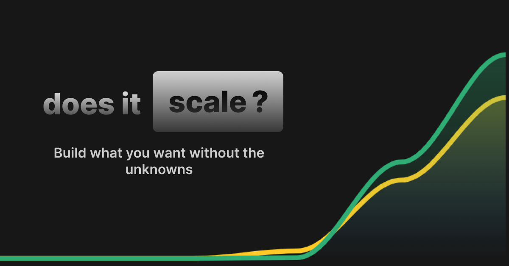

<p align="center">
  
</p>

<h1 align="center">
  Welcome to DoesItScale.dev
</h1>

<p align="center">
  <strong><a href="https://doesitscale.dev/">Try me!</a></strong>
</p>

<p align="center">
  <strong>DoesItScale.dev</strong> helps you compare pricing for different developer tools so you can build what you want without the unknowns. Our algorithms for pricing comparison are open sourced in this repository, allowing you to see how we calculate and compare costs across different services.
</p>

## About This Repository

This repository contains:

- **Open Source Pricing Algorithms for all services on doesitscale.dev**: These are available for community use and contributions. If you spot an issue or an outdated pricing model, please feel free to submit a pull request or open an issue.

- **Local Test UI**: A UI that displays the data for these algorithms. It's designed for local testing and development.

### Contributing

We welcome contributions of all kinds from the community. Here are some ways you can help:

- **Update Pricing**: If you have more current pricing information, please submit a pull request with the updated data.
- **Add New Services**: Help us expand our comparisons by adding new services to the algorithms.

### Getting Started

To get started with this project:

1. Clone the repository:
   ```bash
   git clone https://github.com/Porter-smith/does-it-scale.git
   ```
2. Install dependencies:
   ```bash
   cd doesitscale.dev
   pnpm install
   ```
3. Run the project locally:
   ```bash
   pnpm dev
   ```

### More Information

Please be aware that while the pricing and authentication algorithms are open source, the frontend code is maintained separately and is not open sourced.
